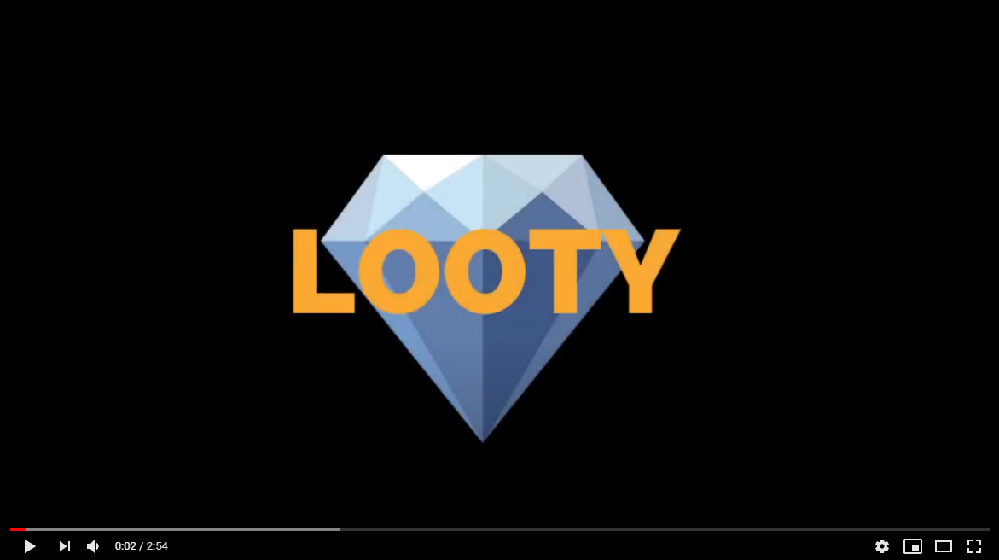

   

Looty est un jeu développé par Tom Pastor dans le cadre du module Développement d'applications mobiles. Celui-ci reprend le principe du jeu [diamant](https://fr.wikipedia.org/wiki/Diamant_(jeu)) et repose sur Firebase (Authentification, Storage, Realtime DB, et Cloud Functions)

## Vidéo de démonstration du jeu

## Synthèse finale (19/06/2020) 
### Synthèse Globale
Durant ce projet, j'ai essayé de noter à chaque fois que je travaillais sur le projet lors de la phase de développement. Cela m'a permis de noter au fur et à mesure les problèmes que j'ai pu rencontrer.
J'ai dû passer environ 70h sur ce projet à partir de la phase de développement. J'ai beaucoup appris car c'était la première fois que je créais une application aussi complète sous Ionic.
J'ai aussi pu découvrir Firebase (Base de données en temps réel, Storage, Authentification, Cloud Functions) qui me parait très puissant.

### Difficultés rencontrées 
* La prise en main de Firebase, le temps de comprendre les différents modules et comment les utiliser m'a pris beaucoup de temps. J'ai notamment eu et j'ai toujours du mal avec Firebase Realtime Database car il s'agit d'un arbre JSON et non d'une BDD SQL comme j'en avais l'habitude. J'ai tendance à toujours penser en SQL, donc des choses très simple en SQL sont parfois complexes avec la BDD firebase.
* Le système de partie, il faut réfléchir en évènement dans mon arbre JSON avec les firebase Cloud Functions.
* Difficultés pour trouver des ressources (Jeu + Firebase Realtime DB + Ionic), peu d'éléments de théorie
* Tester ce que je code est assez long, je dois relancer à chaque fois en réinitialisant ma base de données. Idem pour les cloud functions, il faut deployer les fonctions ce qui prend du temps avant de pouvoir les tester.
* Parfois les cloud functions mettent du temps à se déclencher/exécuter, je ne comprends pas vraiment d'où cela vient étant donné que le temps d'éxécution des fonctions est raisonnable.

### Ce que j'ai pu réaliser
* Création de toutes les pages de la maquette en statique
* Gestion de la connexion et d'inscription en utilisant Firebase Authentification ainsi que Firebase Storage pour stocker l'image de profil
* Récupération des informations de l'utilisateur une fois connecté pour les afficher sur son profil (DataBinding)
* Création d'un système de salle d'attente basé sur la BDD Firebase Realtime Database (dès que la salle est pleine, on crée une partie)
* Création de la partie avec distribution des cartes aléatoirement et initialisation des variables de jeu
* DataBinding pour afficher les informations de jeu en temps réel sur l'écran de l'utilisateur
* Création des fonctions de jeu suivantes à l'aide de Firebase Cloud Functions :
    * Fonction onNewPlayer : Création d'une partie lorsque la salle d'attente est pleine
    * Fonction onNewManche : Redistribution des cartes, réinitialisation du nombre de diamants etc... lorsque l'on démarre une nouvelle manche
    * Fonction onFinTour :  Appel de onNewManche si tous les joueurs sont au camp | sinon s'il reste des joueurs en mine, on recommence un nouveau tour
    * Fonction onUpdateCartes : Distribution des diamants à chaque fois qu'une carte est dévoilée + détection des pièges
* Le jeu est fonctionnel, seul problème le temps de déclenchement des Cloud Functions est variable et parfois long (10-15 secondes)
* A la fin de la partie, les statistiques des joueurs (victoires, défaites, nb parties) sont actualisées en fonction de leur classement.
* Affichage du classement par nombre de défaites, victoires ou du nombre de parties

## Récapitulatif global du 13/05
### Où j'en suis actuellement  | Temps passé (environ 50h)
Comme vous pourrez le voir dans la partie suivante [Avancement](#Avancement) voici la liste des taches réalisées jusqu'à maintenant: 
* Création de toutes les pages de la maquette en statique
* Gestion de la connexion et d'inscription en utilisant Firebase Authentification ainsi que Firebase Storage pour stocker l'image de profil
* Récupération des informations de l'utilisateur une fois connecté pour les afficher sur son profil (DataBinding)
* Création d'un système de salle d'attente basé sur la BDD Firebase Realtime Database (dès que la salle est pleine, on crée une partie)
* Création de la partie avec distribution des cartes aléatoirement et initialisation des variables de jeu
* DataBinding pour afficher les informations de jeu en temps réel sur l'écran de l'utilisateur
* Création des fonctions de jeu suivantes à l'aide de Firebase Cloud Functions :
    * Fonction onNewPlayer : Création d'une partie lorsque la salle d'attente est pleine
    * Fonction onNewManche : Redistribution des cartes, réinitialisation du nombre de diamants etc... lorsque l'on démarre une nouvelle manche
    * Fonction onFinTour :  Appel de onNewManche si tous les joueurs sont au camp | sinon s'il reste des joueurs en mine, on recommence un nouveau tour

### Difficultés rencontrées
* La prise en main de Firebase, le temps de comprendre les différents modules et comment les utiliser m'a pris beaucoup de temps. J'ai notamment eu et j'ai toujours du mal avec Firebase Realtime Database car il s'agit d'un arbre JSON et non d'une BDD SQL comme j'en avais l'habitude. J'ai tendance à toujours penser en SQL, donc des choses très simple en SQL sont parfois complexes avec la BDD firebase.
* Le système de partie, il faut réfléchir en évènement dans mon arbre JSON. Exemple : Si la valeur de manche est incrémentée, alors il faut changer le Array cartes en remélangeant les cartes etc...
* Difficultés pour trouver des ressources (Jeu + Firebase Realtime DB), peu d'éléments de théorie
* Tester ce que je code est assez long, je dois relancer à chaque fois en réinitialisant ma base de données. Idem pour les cloud functions, il faut deployer les fonctions ce qui prend du temps avant de pouvoir les tester.
* Parfois les cloud functions mettent du temps à se déclencher/exécuter la première fois (il faut que je regarde d'où cela provient)

La combinaison de tout cela fait que l'avancement de mon projet prend plus de temps que ce que j'avais imaginé au départ. J'ai l'impression d'avancer très lentement, mais j'apprends beaucoup de chose concernant firebase. Je me remet souvent en question aussi, car je suis sûr qu'il y a une meilleure méthode pour faire ce que j'essaye de faire. C'est la première fois que passe autant de temps sur un projet tout seul et en ayant autant de difficultés, c'est donc un peu déroutant certaines fois.

### Ce qu'il me reste à faire | Temps estimé (environ 20-25h)
* La fin de l'implémentation de l'algo de jeu (Distribution des diamants aux joueurs en mine et repartition des diamants restants entre les joueurs dans le camp, gestion des pièges, gestion de fin de partie etc...)
* Revoir la structure pour stocker le nombre de diamant correspondant à la valeur de la carte et faire les modifications nécéssaires
* Création du système de podium à la fin de la partie
* Création du système de classement global (par victoires, nombre de parties et de défaites)

## Avancement

### 12/04/2020 : Création des pages (3h00)
Création des pages statiques en partant de la maquette réalisée précédemment.

### 13/04/2020 : Authentification (5h00)
Pour l'authentification des joueurs dans l'application, j'ai utilisé FireBase Authentification qui est un module permettant la connexion et l'inscription de joueur avec un email et un mot de passe en lui associant un ID unique.

Cependant j'avais aussi besoin d'un pseudonyme et d'une photo de profil. J'ai donc dans un premier temps utilisé FireBase Storage afin d'upload une image depuis le téléphone du joueur sur les serveurs FireBase. J'ai ensuite utilisé le module FireBase Real Time Database, afin de stocker l'ID unique du joueur, son mail, son pseudo ainsi que l'URL de l'image stocké sur le serveur FireBase Storage.

Beaucoup de difficultés + beaucoup de réflexion (comment agencer les modules entre eux), première prise en main du TypeScript...

### 15/04/2020 : Mon Compte (3h00)
- Récupération des informations de l'utilisateur connecté : pseudo, mail, nombre de parties jouées, gagnées ainsi que la photo de profil
- Remplissage dynamique de la page avec ces informations

Difficultés : Récupération de la photo de profil à partir de l'URL de l'image stockée sur Firebase Storage

### 16/04/2020 : Création des assets graphiques (2h00)
- Retravailler le logo
- Créer le design des cartes de diamant, piège et trésor.

### 17/04/2020 : Système d'attente d'avant partie (5h30)
Je n'avais pas pensé à ça lors de la création de ma maquette. J'ai donc du réfléchir à un système de salle d'attente où les joueurs patientent jusqu'à être 5 et commencer une partie.
On a donc une page qui s'auto-actualise avec les pseudo des joueurs en attente.
Pour cela, dès qu'un joueur passe en attente, on crée une entrée sur la BDD du style : waitingRoom/UserID .
Ensuite on récupère les UID des joueurs en attente puis on récupère ensuite le pseudonyme de ces joueurs et on les affiche.

Je ne voyais vraiment pas comment faire au début pour l'attente et la création d'une salle de jeu + le jeu en lui même. J'ai résolu le premier souci à savoir l'attente des joueurs. Je pense avoir une idée pour ensuite créer la salle de jeu (FireBase Functions)
Cela reste encore très flou, et il y a peu de ressources sur internet expliquant comment utiliser Ionic et Firebase pour créer un jeu en temps réel. Cela me prend donc beaucoup de temps pour lire la doc etc... J'espère vraiment pouvoir finir mon jeu

Difficultés : Prise en main de FireBase Realtime Database (Format de la BDD n'est pas SQL mais un unique arbre JSON) + detection de changement pour actualiser la liste des joueurs en attente en temps réel (changeRef.detectChanges()) + format des requetes 

### 18/04/2020 : Création d'une partie (6h00)
Utilisation de FireBase Cloud Functions permettant d'executer des fonctions depuis le backend à partir de trigger provenant de la base de donnée en temps réel. J'ai pour l'instant crée deux fonctions :
- Fonction qui s'exécute à chaque fois qu'un joueur passe en attente d'une partie
A chaque fois, on vérifie si on a atteint le nombre minimum de joueurs requis. Si c'est le cas, on supprime ces joueurs de la salle d'attente, on crée une partie qui aura pour nom la concaténation de tous les UID des joueurs présents dans la partie et on initialise toutes les valeurs utiles pour la parties.

- Fonction qui s'exécute à chaque fois que le champ manche est crée ou actualisé
A chaque fois, on mélange l'ensemble des cartes

Pour les cartes faire un tableau du style (num_carte (nom_carte, diamant))
0 -> ("piege1",0)
1 -> ("carte1",3)

Fonctions à rajouter :
- A chaque fois que taille de player en attente == NUM_PLAYER ou que la taille de player en jeu == 0, alors fin du tour ->  on pick une carte (incremente carte_en_cours) + distribution des diamants à la fin du tour (encore en mine) + distribution des diamants restants répartis avec tous les joueurs
- A chaque fois que update(carte_en_cours) -> On vérifie qu'on a pas deux pièges similaires qui sont sortis -> Fin de manche (mance: incremente(1))
- A chaque fois que manche est update, vérifier que manche <= 5 sinon => fin de partie avec podium

Structure BBD firebase pour la partie jeu :

### Séances de TP 7/05/2020 et 11/05/2020: Redirection utilisateur + binding (Séances de TP : 6h00)
Redirection de l'utilisateur une fois que la partie a été créee (salle d'attente complète) + passage de l'ID de la partie en paramètre de l'URL + récupération des informations depuis la page de jeu en faisant un binding avec les informations de la base de données en temps réelle.

### 11/05/2020 (4h00)
Positionnement des éléments de jeu en statique + parse des données de la base de donnée dans un objet TypeScript.
J'ai l'impression de ne pas avoir avancé beaucoup ce soir malgré le temps passé, j'ai rencontré pas mal de soucis un peu bête mais qui m'ont pris du temps à résoudre pour regrouper les données.

Eléments de jeu statique :

### 12/05/2020 (4h00)
-Fin du binding pour la partie joueur : récupération des pseudos des joueurs dans la partie, de leurs images de profil et des données de jeu de chacun. + récupération des cartes

Illustration:

### 13/05/2020 : Actions utilisateur + nouvelle manche + fin de tour (6h30)
-Ajout des actions utilisateurs (explorer la mine ou rentrer au camp) -> effectue les changements nécéssaires dans la BDD + cache les boutons quand les joueurs sont en attente
-Modification de la fonction Cloud Firestore de nouvelle manche qui re mélange les cartes et stocke le nombre de diamant etc...
-Ajout d'une fonction de fin de tour, si tous les joueurs sont au camp -> nouvelle manche sinon et si tous les joueurs sont en attente alors c'est un nouveau tour.

Difficultés :  - Toujours un peu de mal avec Firebase, dont la méthode pour effectuer des choses très simples est parfois très compliqué (pour moi et avec mes connaissances actuellement)

### 21/05/2020 et 25/05/2020 : Création de fonctions pour le jeu (10h00)
J'ai changé l'architecture de ma base de données firebase, j'ai ajouté un nouvel état ('rentre') pour pouvoir voir quel joueur vient de rentrer.
Réflexion au niveau de l'algorithme du jeu
J'ai aussi ajouté un champ qui contient le nombre de diamant en attente (pour les joueurs qui vont rentrer de la mine)
Fonction de distribution des diamants aux joueurs qui rentrent de la mine (le nombre de diamant total est divisé par le nombre de joueurs qui viennent de rentrer)
Fonction de distribution des diamants aux joueurs encore en mine, à chaque nouvelle carte (idem)
Fonction de détection des pièges (si deux pièges pareils alors fin de la manche)

### 29/05/2020 : Finalisation des fonctions de jeu (4h00)
Finalisation de toutes les fonctions de jeu. Toujours un peu de latence pour le déclenchement des fonctions. Réflexion au niveau de l'algorithme du jeu

### 11/06/2020 : Gestion du classement (1h30)
Récupération et affichage du classement avec les défaites, victoires et nombre de parties jouées. 

### 16/06/2020 : Fonction de fin de partie (2h30)
Fonction qui à la fin de la partie (manche > 5), incrémente le nombre de victoire, de défaite et le nombre de parties de chaque joueur en fonction de son classement dans la partie.
Redirection automatique des joueurs à la fin de la partie + suppression des données de jeu.

### 18/06/2020 : Génération de l'APK + modifications (1h30)
Ajout de l'image de profil sur le sidemenu + correction d'un problème lors de la redirection à la fin du partie
Ajouter page mon compte récupération des info de partie

### 19/06/2020 : Génération de l'APK + modifications (1h30)
Ajout de commentaires dans le code
Ajout du logo de looty et du splashscreen
Recherche du souci pour la latence dans le déclenchement des firebase functions
Re-génération de l'APK

## Modifications à faire
- FAIT Ajout d'un message d'erreur sur la page de connexion (Mot de passe incorrect etc...)
- FAIT Remise en forme de la page inscription avec les deux boutons pour ajouter une image
- Page Recherche de partie : Ajout de la photo de profil à coté des pseudos
- Ajouter podium de fin de partie

## Bug à corriger
- Page de recherche de partie : Lorsque le dernier joueur en attente quitte l'attente, les autres joueurs le voient encore en attente s'il reste sur la page sans faire d'action.

- CORRIGÉ 18/04/2020 : Page Mon Compte : Lorsque l'utilisateur est déja connecté et lance l'appli, les champs ne sont pas remplis. Il faut recharger la page pour que les informations se remplissent et s'affichent.

